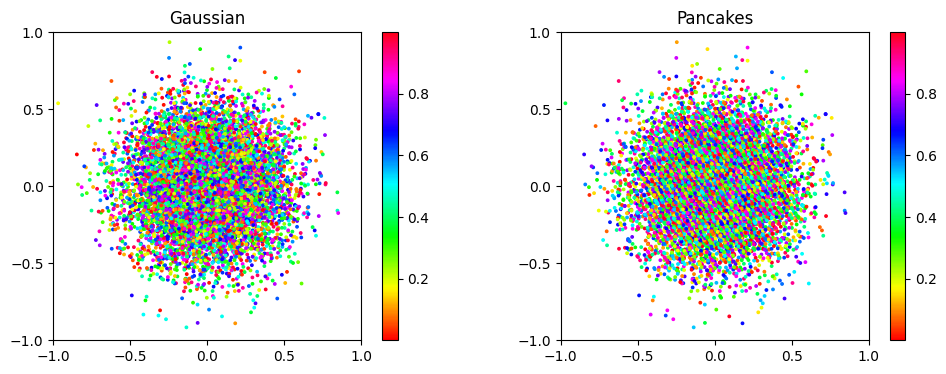
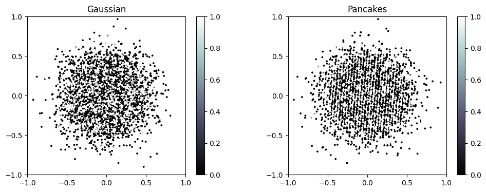

# gaussian-pancakes-examples
Compare the sampled colors of sample points from gaussian and gaussian pancakes.

PS: points both sampled from gaussian.

## In this example, the color is in [0,1).

## In this example, the color has fixed in 0 or 1

